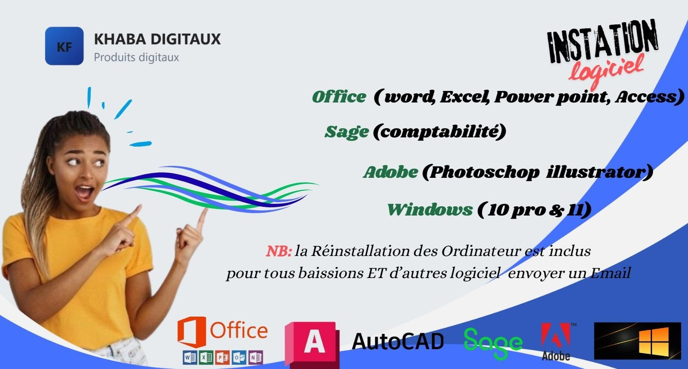

<!doctype html>
<html lang="fr">
<head>
  <meta charset="utf-8" />
  <meta name="viewport" content="width=device-width,initial-scale=1" />
  <title>Boutique - Produits Digitaux & Beauté</title>
  <meta name="description" content="Boutique en ligne simple pour vendre des produits digitaux et des produits de beauté. HTML + CSS uniquement, prêt à personnaliser." />

  
</head>
<body>

  

    <!-- Header -->
    <header class="site-header" role="banner">
      

        

          
KF

          

            <h1>KHABA DIGITAUX</h1>
            
Produits digitaux

          

        

        <nav aria-label="Navigation principale">
          

            <a href="#digital">Digitaux</a>
            
            <a class="cta" href="https://wa.me/224611755368?text=Bonjour%2C%20je%20souhaite%20acheter%20KF%20KF-SHOP%20%281%20unit%C3%A9%29.%20Nom%3A%20__.%20Adresse%3A%20__.%20Merci.">Contact / Acheter</a>
          

        </nav>
      

    </header>

    <!-- Hero -->
    <section class="hero" aria-label="Intro">
      

        <h2>Bienvenue dans notre boutique</h2>
        
Vendez et achetez des produits digitaux (e-books, templates, formations) et des produits de beauté locaux. Simple, propre et prêt à personnaliser.

        

          <a class="btn btn-primary" href="#products">Voir les produits</a>
          <a class="btn btn-outline" href="#contact">Nous contacter</a>
         
        
  
      

      <aside class="hero-right">
        
Recherche rapide

        <form class="search" onsubmit="return false;"> 
          <input type="search" placeholder="Rechercher un produit..." aria-label="Rechercher" />
          <button class="btn btn-primary" type="submit">OK</button>
        </form>

        

          
Livraison: numérique & locale

          
Paiement: Mobile Money / Espèces

        

      </aside>
    </section>

    <!-- Categories -->
    

      <a class="cat active" href="#products">Tous</a>
      <a class="cat" href="#digital">Produits digitaux</a>

    

    <!-- Products - Digital -->
    <section id="digital">
      

        <h3>Produits digitaux</h3>
        <a class="see-all" href="#products">Voir tout</a>
      

      

        <!-- Produit 1 -->
        <article class="product">
          

          

            
E-book: Guide Marketing Digital

            
Un guide complet pour apprendre à vendre en ligne en Guinée — stratégie, canaux, publicité.

            

              

                
25 000 GNF

                
Livraison: lien instantané

              

              

                <a class="buy buy-mail" href="+224.html">Acheter</a>
                Format: PDF
              

            

          

        </article>

        <!-- Produit 2 -->
        <article class="product">
          

          

            
cour de trading

            
Connaitre et comprendre les stratégies du trading.

            

              

                
25 000 GNF

                
Licence: usage commercial

              

              

                <a class="buy buy-mail" href="+224.html">Acheter</a>
                Format: PDF
              

            

          

        </article>

        <!-- Produit 3 -->
        <article class="product">
          

          

            
Cour de word pdf & video>

            
modules pdf & vidéo pour metriser le logiciel word.

            

              

                
50 000 GNF

                
Accès: 30 jours

              

              

                <a class="buy buy-mail" href="+224.html">Acheter</a>
                Format: Vidéo & PDF
              

            

          

          
        </article>

      

    </section>
    

    <!-- Products - Beauté -->
    <section id="beaute" style="margin-top:22px;">
      

      
       
      

      

        <!-- Produit beauté 1 -->
        <article class="product">
          

          

            
Cour de Excel pdf & video

            
modules pdf & vidéo pour metriser le logiciel word.

            

              

                
60 000 GNF

                

              

              

                <a class="buy buy-mail" href="+224.html">Acheter</a>
                Format: video & PDF
              

            

          

        </article>

        <!-- Produit beauté 2 -->
        <article class="product">
          

          

            
Cour de Power point pdf & video

            
modules pdf & vidéo pour metriser le logiciel word.

            

              

                
45 000 GNF

                

              

              

                <a class="buy buy-mail" href="+224.html">Acheter</a>
                Format: video & PDF
              

            

          

        </article>

        <!-- Produit beauté 3 -->
        <article class="product">
          

          

            
Cour d'Access pdf & video

            
modules pdf & vidéo pour metriser le logiciel word.

            

              

                
95 000 GNF

                

              

              

                <a class="buy buy-mail" href="+224.html">Acheter</a>
                Format: video & PDF
              

            

          

        </article>

     

              

            

          

        </article>
         

    <!-- Products - Digital -->
    <section id="digital">
      

      
      

      

        <!-- Produit 1 -->
        <article class="product">
          

          

            
Cour HTML pdf & video

            
modules pdf & vidéo pour metriser le logiciel.

            

              

                
50 000 GNF

                
Livraison: lien instantané

              

              

                <a class="buy buy-mail" href="+224.html">Acheter</a>
                Format: video & PDF
              

            

          

        </article>

        <!-- Produit 2 -->
        <article class="product">
          

          

            
Cour de CSS

            
modules pdf & vidéo pour metriser cette langage de programation.

            

              

                
55 000 GNF

                
              

              

                <a class="buy buy-mail" href="+224.html">Acheter</a>
                Format: video & PDF
              

            

          

        </article>

        <!-- Produit 3 -->
        <article class="product">
          

          

            
Formation en sage comptabilité

            
Gérez efficacement vos finances et votre comptabilité grâce à Sage.

            

              

                
85 000 GNF

                

              

              

                <a class="buy buy-mail" href="+224.html">Acheter</a>
                Format: video & PDF
              

            

          

          
        </article>

      

    </section>

    <!-- Products - Beauté -->
    <section id="beaute" style="margin-top:22px;">
      

       
        
      

      

        <!-- Produit beauté 1 -->
        <article class="product">
          

          

            
PYTHON programation

            
Développemtent Mobile pour plus de comprehention.

            

              

                
108 000 GNF

              

              

                <a class="buy buy-mail" href="+224.html">Acheter</a>
                Format: video & PDF
              

            

          

        </article>

        <!-- Produit beauté 2 -->
        <article class="product">
          

          

            
JAVA Scrip

            
Apprenez JavaScript dès aujourd’hui et transformez vos idées en sites et applications modernes !.

            

              

                
55 000 GNF

                
              

              

                <a class="buy buy-mail" href="+224.html">Acheter</a>
                Format: video & PDF
              

            

          

        </article>

        <!-- Produit beauté 3 -->
        <article class="product">
          

          

            
GESTION DU PROJET

            
Développez vos compétences en gestion de projet pour diriger avec méthode et efficacité.

            

              

                
125 000 GNF

                
              

              

                <a class="buy buy-mail" href="+224.html">Acheter</a>
                Format: PDF
              

            

          

        </article>

     

              

            

          

 
           

    <!-- Products - Digital -->
    <section id="digital">
      

        
        
      

      

        <!-- Produit 1 -->
        <article class="product">
          

          

            
RESSOURCE HUMAINES

            
"Maîtrisez les bases des ressources humaines pour mieux gérer et motiver vos équipes.".

            

              

                
25 000 GNF

                
              

              

                <a class="buy buy-mail" href="+224.html">Acheter</a>
                Format: PDF
              

            

          

        </article>

        <!-- Produit 2 -->
        <article class="product">
          

          

            
PHOTOSHOP

            
Pack de templates modifiables pour boutiques et flyers — prêt à l'emploi.

            

              

                
80 000 GNF

                
Libérez votre créativité et transformez vos images avec Photoshop.

              

              

                <a class="buy buy-mail" href="+224.html">Acheter</a>
                Format: video & PDF
              

            

          

        </article>

        <!-- Produit 3 -->
        <article class="product">
          

          

            
ILLUSTRATOR

            
Créez des designs professionnels et uniques grâce à Illustrator

            

              

                
85 000 GNF

                
              

              

                <a class="buy buy-mail" href="+224.html">Acheter</a>
                Format: Vidéo & PDF
              

            

          

          
        </article>
   
      

      

    </section>
    
      <!-- Products - Digital -->
    <section id="digital">
      

        
        
      

       

      

        <!-- Produit 1 -->
        <article class="product">
          

          

            
Word Press

            
"Maîtrisez et Creer votre site de vente avec cette formation .".

            

              

                
125 000 GNF

                
              

              

                <a class="buy buy-mail" href="+224.html">Acheter</a>
                Format: VIDEO
              

            

          

        </article>
      

        <!-- Produit 2 -->
        <article class="product">
          

          

            
Cyber Sécurité

            
formation pratique et efficacité pour les debutant.

            

              

                
150 000 GNF

                
Formation en Cyber securité .

              

              

                <a class="buy buy-mail" href="+224.html">Acheter</a>
                Format: video 
              

            

          

        </article>

        <!-- Produit 3 -->
        <article class="product">
          

          

            
Canva

            
Formeation Création des designs professionnels et uniques grâce à canva avec syplicité et suivis des formations bonus

            

              

                
105 000 GNF

                
              

              

                <a class="buy buy-mail" href="+224.html">Acheter</a>
                Format: Vidéo
              

            

          

          
        </article> 
         <article class="product">
          

          

            
CISCO.CCNA.CCNP

            
formation pratique et efficacité pour les debutant EN CISCO .

            

              

                
120 000 GNF

                
Formation en CISCO .

              

              

                <a class="buy buy-mail" href="+224.html">Acheter</a>
                Format: video 
              

            

          

        </article>
         <article class="product">
          

          

            
BIG DATA

            
formation pratique et efficacité pour les debutant.

            

              

                
130 000 GNF

                
Formation en BIG DATA POUR BOUSTER VOTRE COMPETENCE .

              

              

                <a class="buy buy-mail" href="+224.html">Acheter</a>
                Format: video 
              

            

          

        </article>
         <article class="product">
          

          

            
CERTIFICATION EN DJANGO

            
formation pratique et efficacité pour les debutant.

            

              

                
90 000 GNF

                
Formation en DJANGO .

              

              

                <a class="buy buy-mail" href="+224.html">Acheter</a>
                Format: video 
              

            

          

        </article>
         <article class="product">
          

          

            
HACKING 

            
formation pratique et efficacité pour les debutant EN HACKING.

            

              

                
160 000 GNF

                
Formation en HACKING.

              

              

                <a class="buy buy-mail" href="+224.html">Acheter</a>
                Format: video 
              

            

          

        </article>
         <article class="product">
          

          

            
CAPCUT

            
formation pratique et efficacité SUR CAPCUT.

            

              

                
110 000 GNF

                
Formation en CAPCUT pour vos montage video .

              

              

                <a class="buy buy-mail" href="+224.html">Acheter</a>
                Format: video 
              

            

          

        </article>
         <article class="product">
          

          

            
LINKEDIN

            
formation pratique et efficacité pour les debutantS en LINKEDIN

            

              

                
100 000 GNF

                
Formation en LINKEDIN .

              

              

                <a class="buy buy-mail" href="+224.html">Acheter</a>
                Format: video 
              

            

         
          

        </article>
         <article class="product">
          

          

            
INDISIGN

            
formation pratique et efficacité pour les debutant en disign.

            

              

                
90 000 GNF

                
Formation en ABDODE InDisign .

              

              

                <a class="buy buy-mail" href="+224.html">Acheter</a>
                Format: video 
              

            

          

        </article>
    <article class="product">
          

          

            
AUTO-ENTREPRENEUR

            
Savoir L'entreprenarient.

            

              

                
100 000 GNF

                
Formation AUTO.

              

              

                <a class="buy buy-mail" href="+224.html">Acheter</a>
                Format: video 
              

            

          

        </article>
          <article class="product">
          

          

            
AUTO-CAD

            
INGENIEUR ARCHITECTE EN ACTION.

            

              

                
200 000 GNF

                
Formation en AUTO-CAD.

              

              

                <a class="buy buy-mail" href="+224.html">Acheter</a>
                Format: video 
              

            

          

        </article>
      

      

          
        

          
          

            <h2 style="text-align: center;">INSTATION DES LOGICIELS CONFORMENT A VOS SERVIR ET A VOS FORMATIONS</h2>
            
Vous voyer pas vos logiciel prierre d'envoyer un email pour une revervations

        

         
     
    

     

    
    

      <h2 style="text-align: center;">Vous Attender toujour pour vos logiciel</h2>
      
Reserver votre logiciel en cliquant sur le bouton 
 <em> " Reserver votre logiciel "</em> 
 et renplire les formulaires de reservation

      <a href="RESERVATION.html" class="btn"> Reserver votre logiciel</a>

        <section id="contact" style="margin-top:28px;">
      

        <h3>Contact & Commande</h3>
        Commandez par mail ou via Mobile Money
      

      

      

        

          
Pour finaliser un achat, envoyez un email à <strong>kabamaman624@gmail.com</strong> en précisant : nom, produit, quantité, adresse ou numéro Mobile Money. Vous recevrez ensuite les instructions de paiement.

          <ul style="margin-top:10px;list-style:none;display:grid;gap:8px;">
            <li class="small">• Paiement Mobile Money (Orange Money, MTN Mobile Money)</li>
            <li class="small">• Paiement en espèces (retrait en point de vente)</li>
            <li class="small">• Produits digitaux : lien d'accès après paiement</li>
          </ul>
        

        <aside style="background:#53a5c1;padding:14px;border-radius:10px;box-shadow:0 6px 18px rgba(16,24,40,0.04);">
          <h4 style="margin-bottom:8px;">Support rapide</h4>
          
WhatsApp : <strong>+224 611 75 53 68</strong>

          
Email : <strong>kabamaman624@gmail.com</strong>

          
Horaires : Lun - Sam, 08:00 - 18:00

          
<a class="btn btn-primary" href="https://wa.me/224611755368?text=Bonjour%2C%20je%20souhaite%20acheter%20KF-PRODUIT DIGITAUX.%20Nom%3A%20__.LAISSEZ UN MESSAGE POUR TOUS SOUCIS %3A%20__.%20Merci.">Appel WhatsApp</a>

        </aside>
      

    </section>

    <!-- Footer -->
    <footer>
      

        

          <strong>KHABA Digital</strong>
          
© "KF Digital" - Tous droits réservés

        

        
Conception & mise en page : vous

      

    </footer>

  

</body>
</html>

